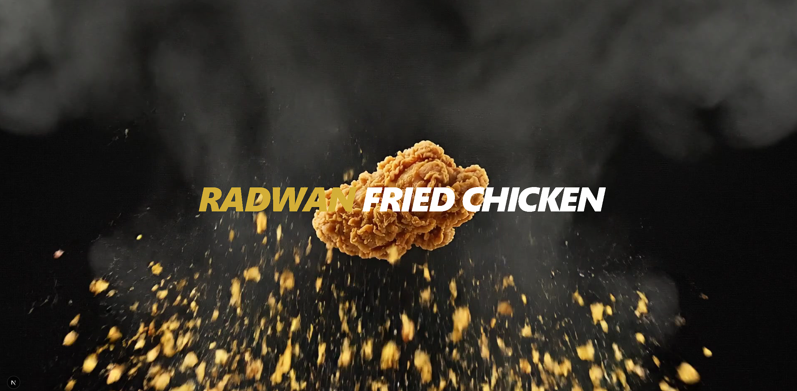

# Radwan Fried Chicken — 3D Animation-Driven Web Experience
🔗 [Radwan Fried Chicken](https://radwanfriedtrippyyyy.vercel.app/)

A modern 3D animation–driven website built with **Next.js**, **React**, and **Framer Motion**, delivering smooth visuals, interactive motion, and high-performance rendering. This project focuses on cinematic 3D sequences and rich UI animations combined with a clean, scalable frontend architecture.

---



## ✨ Features

- 🌀 High-quality 3D animation sequences  
- ⚡ Next.js App Router for fast routing and rendering  
- 🎬 Framer Motion for smooth, expressive animations  
- 🎨 Tailwind CSS for rapid, consistent styling  
- 🧠 TypeScript for type safety and maintainability  
- 🧩 Reusable component architecture  
- 🚀 Optimized for performance and modern browsers  

---

## 🛠 Admin & Asset Management

A modern admin dashboard for real-time asset curation and management:

- **Asset Curation:** Integrated upload widget for adding new promotional offers  
- **Metadata Management:** Manage gallery details including titles, prices, and descriptions  
- **Folder Navigation:** Structured organization inside the `radwan` Cloudinary namespace  
- **Secure Operations:** Built with Next.js Server Actions for robust resource handling (Delete/Edit)  

---

## 🛠 Tech Stack

* **Next.js** (App Router)
* **React**
* **Framer Motion**
* **Tailwind CSS**
* **TypeScript**
---

## 📁 Project Structure

```
src/
├── app/              # Next.js App Router pages & layouts
├── components/       # Reusable UI components
public/
├── sequence/         # Image sequences for animation frames
ProjectPrompts/
├── *.md              # AI / animation prompt documentation
```

---

## 🎞 Animation Notes

* Image sequences stored in `public/sequence/`
* Animations orchestrated using **Framer Motion**
* Designed to support future **WebGL / Three.js** extensions

---

## 🧠 Project Goals

* Showcase immersive 3D motion on the web
* Maintain clean, readable, and scalable codebase
* Push visual storytelling using modern frontend tools

---

## 🌍 Development Branches

Live development versions of the project are available here:
🔗 [Main Website](https://radwanfriedtrippyyyy.vercel.app/)

---

## 📹 Video Demos

<video controls src="public/rad.mp4" title="Title"></video>


---


Made with ❤️ using modern web technologies for a rich and interactive user experience.


